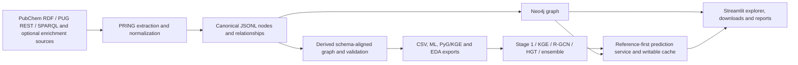

# PRING Framework — comprehensive critical technical assessment

**Assessment date:** 2026-07-26  
**Scope:** `PRING-PACKAGE`, `PRING-APP`, and the locally available generated graph, EDA, modeling, production-model, and prediction-cache artifacts  
**Reviewed repository revisions:** PRING-PACKAGE `6e49d8f` (2026-06-17); PRING-APP `65b8876` (2026-07-26)

## 1. Executive conclusion

PRING is a substantial research-software prototype with a credible end-to-end vision and several good implementation choices. The package can collect and normalize heterogeneous PubChem-centered evidence, preserve an auditable JSONL representation, materialize a rich property graph, create Neo4j and modeling exports, and produce unusually detailed EDA. The application provides a useful guided CYP450 explorer, structured downloads, HTML reports, an integrated modeling stack, and a thoughtfully separated reference-score/live-prediction cache design.

The framework is **not currently production-ready, release-ready, or publication-ready for predictive-performance claims**. The primary blockers are not cosmetic:

1. The deployed ensemble's split provenance is invalid for confirmatory evaluation. Every component-score split in the 5,861-row production frame is `test`; a new compound-group `final_split` was created over those already-generated test predictions, yet the production manifest calls this an “explicit validation partition.”
2. “Identifier-free” graph tensors contain PubChem CIDs and CID-derived missingness columns.
3. The package has an environment-dependent PyG export branch that writes full-graph edges to `heterodata.pt`; the application prefers that file and returns a raw `HeteroData` without replacing it with train-only edges.
4. Label semantics are not sufficiently stable or scientifically specific. An aggregated “interaction” mixes distinct biological meanings and is affected by threshold/configuration drift between package creation and application rematerialization.
5. Stage 1 and the older ensemble path tune thresholds on their test partitions. Multi-seed finalized validation selects the best seed by test MCC when more than one seed is used.
6. Neo4j loading collapses distinct parallel evidence relationships with the same endpoints and type.
7. Production-cache keys do not include model, dataset, graph, or preprocessing versions; stale scores can be reused silently.
8. Default deployment exposes unauthenticated application and prediction endpoints, host-published Neo4j, default credentials, unrestricted APOC/GDS procedures, and no TLS or least-privilege boundary.
9. Modeling implementations are duplicated and an implementation-switching script can delete the serving-only modules from the active tree.
10. Reproducibility, licensing, CI, documentation packaging, artifact lineage, and test coverage are not adequate for a software release or publication supplement.

### Overall readiness

| Deliverable | Current decision | Qualification |
|---|---|---|
| Local research demonstration | **Conditionally usable** | Suitable for supervised demonstration with fixed, trusted data and explicit “hypothesis prioritization only” language. |
| Master’s thesis submission | **Not yet ready** | The engineering contribution is defensible, but the quantitative modeling claims must be withdrawn or regenerated after the critical leakage/evaluation fixes. |
| PRING package release | **Not ready** | Missing package license, ignored documentation, no CI/release pipeline, no locked environment, and incomplete artifact provenance. |
| Production deployment | **No-go** | Security, operational, data-integrity, model-governance, and scale-out controls are missing. |
| Predictive-method publication | **No-go** | Current metrics are not confirmatory; no independent external validation, target-cold validation, or fully leakage-audited evaluation exists. |
| Software/architecture publication | **Potentially viable after remediation** | Requires a reproducible release, documented schema/data contracts, archived artifacts, benchmarked performance, and honest separation of implemented versus planned capabilities. |

The safest thesis framing today is: **an end-to-end research framework and CYP450 case study that generates hypotheses**, not a validated system that discovers biologically or clinically confirmed interactions.

## 2. Assessment method and limitations

The assessment traced:

- package configuration, extraction, normalization, schema materialization, validation, Neo4j loading, ML exports, manifests, EDA, CLI, tests, examples, and documentation;
- application Compose topology, loader, Neo4j queries, Streamlit UI, downloads, HTML reports, all modeling stages, final validation, production bundle, live predictor, cache, and tests;
- locally available generated artifacts, including graph counts, EDA tables, 38.95 GiB of prepared modeling data, model manifests, the finalized score frame, and the prediction cache.

Static Python compilation of the package and application source completed. The merged Docker Compose configuration parsed successfully. The declared pytest suites could not be executed in the present workspace without installing dependencies: the local package environment lacks `pytest`, `joblib`, and `scikit-learn`, and there is no complete application test environment. Consequently, this is a code-and-artifact audit, not a claim that all tests pass.

Generated `artifacts/` and package `runs/` are ignored by Git. Findings about current model metrics refer to the local artifacts and are not independently reproducible from the tracked source alone.

## 3. Current implementation

### 3.1 End-to-end architecture



This is conceptually sound. The main architectural weakness is that contracts between the boxes are implicit CSV/file conventions rather than versioned, machine-validated interfaces. The same concepts—labels, split meaning, graph version, feature schema, prediction provenance—are reconstructed independently in several places.

### 3.2 PRING package

The package currently provides:

- PubChem REST/RDF and SPARQL-oriented extraction;
- target/compound filtering, retry/throttling and caching controls;
- normalization into schema-oriented node and relationship records;
- a canonical JSONL run store;
- schema-derived `Interaction`, assay, endpoint, organism, reference, similarity, chemical feature, and protein-enrichment layers;
- CSV mirrors, Neo4j loading, EDA, train/validation/test pair exports, KGE triples, graph tensors, and stage-oriented modeling directories;
- a comparatively broad unit-test suite: 114 discovered test functions across 28 tracked test files.

Positive design choices include:

- unknown compound-target pairs are labeled `unknown`, not silently converted to negatives;
- conflicting endpoint evidence is excluded from binary supervision;
- the package creates a train-only graph export intended to remove held-out interaction/evidence paths;
- JSONL preserves richer relationship provenance than the current Neo4j representation;
- the EDA explicitly flags unknown-pair dominance, class imbalance, endpoint quality, identifier-like features, and split overlap;
- HTTP resilience and schema/key handling receive meaningful test attention.

Important implementation realities:

- the documented FTP mode is a placeholder and raises `NotImplementedError`;
- `pring/export/pyg_export.py` remains a small placeholder while the real exporter lives inside a 4,416-line `run_store.py`;
- `pring/transform/interaction_derive.py` is a starter aggregation routine, not a validated predictive model;
- `run_store.py` (4,416 lines), `cli.py` (2,032), and `run_eda.py` (2,629) combine too many responsibilities;
- schema validation mostly compares observed/declared labels and relationship types and checks key mappings; it does not enforce required properties, property types, relationship cardinalities, domain/range constraints, schema migrations, or ontology semantics.

### 3.3 Knowledge graph and current data

The local graph summary reports, among other layers:

- 762,434 `Compound` nodes;
- 5 `Protein` nodes;
- 74,097 `Endpoint` nodes;
- 56,698 `Interaction` nodes;
- 1,153,364 `MolGraph` nodes;
- 1,675,339 `SIMILAR_TO` relationships;
- 5,852,301 forward graph edges before reverse-edge duplication in PyG.

This is a large **CYP450 case-study graph**, not evidence that the application is domain-generic. The package schema has reusable elements, but the data flow remains PubChem-centered and the application/modeling code hard-codes `Compound`, `Protein`, CYP450 terminology, `INTERACTS_WITH`, five targets, and specific evidence paths.

The graph's explicit `Interaction` node is a good provenance pattern because it can attach endpoints, assays, references, source, organism, and label state. However, Neo4j loading uses:

```cypher
MERGE (a)-[r:TYPE]->(b)
SET r += row.props
```

Distinct relationship records with the same start node, end node, and type therefore collapse. The JSONL deduplication signature includes a property fingerprint, but Neo4j does not. Multi-source or multi-evidence edges can be lost or overwritten, making the in-database graph semantically different from the canonical run.

### 3.4 Modeling data

The package's current EDA reports:

- 35,458 positives;
- 3,295 curated negative/weak pairs;
- 3,755,472 unknown candidates;
- 98.98% unknown pairs;
- positive:negative ratio 10.76;
- train labels: 16,874 positive / 1,945 negative;
- validation labels: 16,413 positive / 1,100 negative;
- test labels: 2,171 positive / 250 negative.

The compound-similarity-component split produces zero direct compound overlap between train, validation, and test, which is a genuine strength. However, component sizes create a highly uneven allocation: about 48.6% of labeled rows are train, 45.2% validation, and 6.2% test rather than the nominal 80/10/10. The validation positive:negative ratio is 14.92 versus about 8.68 in train/test. These partitions are not interchangeable, and the small test negative count makes operating-point estimates uncertain.

The endpoint audit reports:

- 46.68% missing endpoint type;
- 44.31% ambiguous or weak activity labels;
- 46.50% missing units/non-numeric molar values;
- eight values above 1 M;
- one negative-log10-molar value above 12.

These are not merely missing-data inconveniences. They affect what “active,” “inactive,” and “interaction” mean and whether a compound-level label is scientifically coherent.

### 3.5 Application

The application provides:

- Docker Compose services for Neo4j, PRING loading, modeling, prediction, and Streamlit;
- guided, parameterized CYP450 queries rather than arbitrary user Cypher;
- graph visualization and property tables;
- JSON, HTML, and zipped CSV downloads;
- generated HTML evidence and prediction reports;
- a reference-first predictor that can use immutable precomputed scores, a separate production cache, or live Stage 1/R-GCN/HGT inference;
- explicit report language that the output is not causal, clinical, mechanistic, or proof of inactivity/safety.

Those qualifications and fixed parameterized queries are good choices. The reference store also filters legacy cache rows from the finalized modeling frame, and newly cached rows are marked `exclude_from_training=True`. Cache writes use a temporary file plus `os.replace`, which is safer than appending to the validation frame.

The application is nevertheless CYP450-specific:

- the brand, UI actions, helper text, report templates, node colors, query paths, pair resolver, model relation, and target labels are hard-coded;
- the compound selector is capped at 5,000 options although the graph has 762,434 compounds;
- users cannot configure a new domain schema or query catalog without code changes;
- report export is HTML/ZIP, not a governed PDF or archival report format;
- the prediction service's BioAssay evidence query uses `BioAssay-[:HAS_ENDPOINT]->Endpoint`, while the package schema uses `BioAssay-[:HAS_MEASURE_GROUP]->MeasureGrp-[:HAS_ENDPOINT]->Endpoint`, so BioAssay counts can be incomplete.

The active modeling tree has 29 modules while the `improved_v2` implementation source has 23. Six serving modules exist only in the active tree. Running `modeling/scripts/use_implementation.sh improved_v2` removes the active package directory before linking the implementation and can therefore remove those serving modules.

## 4. What is already strong

These strengths should be retained:

1. **Canonical-first data design.** JSONL as the auditable source followed by Neo4j/CSV/ML mirrors is preferable to making Neo4j the sole source of truth.
2. **Explicit evidence model.** Interaction, endpoint, assay, reference, organism, source, substance, and standardization paths enable provenance-aware exploration.
3. **Unknown is not negative.** The package and EDA correctly distinguish unobserved candidate pairs from true negatives.
4. **Attempted analogue leakage control.** Similarity-connected compounds are assigned together, and the current EDA shows zero compound overlap.
5. **Train-only graph concept.** Removing held-out Interaction/Endpoint/evidence paths is the correct direction, even though one serialization branch violates it.
6. **Scientific caveats in prediction reports.** The report explicitly limits claims to an aggregated PRING label and disclaims causal, clinical, safety, and mechanism interpretations.
7. **Reference/cache separation.** Validated precomputed scores and writable inference cache are separate stores.
8. **Parity concept.** Refusing live inference when it cannot reproduce validated component scores is a strong production principle.
9. **EDA breadth.** The package identifies many of the exact scientific risks raised in this review.
10. **Guided UI.** A constrained query catalog is easier to support and safer than unrestricted Cypher for general users.

## 5. Critical issues — must be corrected before thesis claims, release, deployment, or publication

### C1. Production evaluation is built from already-held-out component predictions

**Evidence**

- All five `split__...` columns in `artifacts/results/production/finalized_training_frame.csv` are `test` for all 5,861 rows.
- `final_split` contains 3,792 train, 952 validation, and 1,117 test rows with zero compound overlap.
- `final_validation.py:329-359` explicitly calls the fallback a diagnostic split over already-generated predictions.
- `production_bundle.py:109-121` only verifies that a `final_split` column contains three values.
- `production_bundle.py:192-196` then hard-codes “MCC on the explicit validation partition.”

**Impact**

The base models were evaluated to produce those component scores before the meta-model's new split existed. The new split prevents compound overlap at the ensemble layer but cannot make the component predictions out-of-fold. The reported production test ROC-AUC 0.9787, AP 0.9936, MCC 0.9154, specificity 0.9493, Brier 0.0194, and ECE 0.0197 are therefore diagnostic, not confirmatory.

**Required correction**

- Freeze an immutable split registry before any feature fitting or model training.
- Generate out-of-fold component scores for meta-model training.
- Keep one untouched external/temporal/scaffold holdout that no component, threshold, calibrator, model selection, seed selection, or ensemble sees.
- Persist split origin and audit status with every row.
- Make production bundle creation fail unless `split_audit.diagnostic_split_created == false`, component scores are OOF for train/validation rows, and every artifact has the same dataset/split ID.
- Rename the current metrics and manifest to `diagnostic_only` or remove them from thesis/publication results.

### C2. “Identifier-free” graph tensors contain identifier-derived features

**Evidence**

- `_write_strict_tensor_feature_table` excludes only exact `id_columns` and fields prefixed `key_`/`props_` (`run_store.py:2776-2810`).
- The actual compound tensor has 582 columns and contains `x_molgraph_cid`, `x_properties_cid`, `x_structure_cid`, `x_synonyms_cid`, and their missingness masks.
- The EDA flags 190 identifier-like columns, including those current model-matrix fields.
- The tensor manifest claims `identifier_free: true`.

**Impact**

PubChem CIDs are arbitrary identifiers. They can let models exploit collection order, source/time cohorts, duplicated identity projections, or graph construction artifacts. Even with compound-disjoint labels, this produces non-scientific signal and makes the manifest false. Missingness of identifier projections may itself encode extraction pathways.

**Required correction**

- Replace name heuristics with an explicit allowlist of scientifically justified features.
- Put all identifiers and identifier missingness only in metadata sidecars.
- Fit imputers/scalers on training nodes only for inductive experiments.
- Add an automated feature-lineage manifest with source, transformation, label availability time, and allowed-use stage.
- Add a test that fails if any feature matches identifier/evidence/outcome denylist rules.
- Retrain every graph model and ensemble after regeneration.

### C3. Environment-dependent full-graph leakage in `heterodata.pt`

**Evidence**

- The exporter builds both `edge_index_by_type` and `train_edge_index_by_type`.
- When `torch_geometric` is importable, it writes **full** `edge_index_by_type` into a raw `HeteroData` (`run_store.py:3070-3085`).
- The Stage 3 loader prefers `pyg_export/heterodata.pt`; if it is a `HeteroData`, it returns immediately (`stage3_common.py:513-524`).
- The package documentation says the file includes the train-only edge set for leakage-safe evaluation.

The current local `heterodata.pt` is the dictionary payload form and contains both edge dictionaries; the loader prefers the train-only dictionary for that form. Therefore, this audit does **not** assert that this specific local Stage 3 run used the full graph. The defect is deterministic when the package export environment has PyG installed.

**Impact**

In the affected environment, message passing can expose held-out Interaction, Endpoint, assay, and reference paths during validation/test scoring. Results become environment-dependent and can be grossly optimistic.

**Required correction**

- Write `heterodata_train.pt` and `heterodata_full.pt` as distinct, unambiguous artifacts.
- Make training/evaluation loaders accept train-only data by default and require an explicit flag for full-graph inference.
- Store `graph_scope=train_only|full`, split ID, removed-edge count, and checksums in the serialized object.
- Assert that no held-out supervision pair or its derived Interaction/evidence nodes are reachable through forbidden edges.
- Test both exporter branches with and without PyG installed.

### C4. Test-set tuning remains in active modeling paths

**Evidence**

- Stage 1 includes validation rows in training and optimizes the threshold directly on `X_test` (`stage1_tabular.py:290-305`, `377-384`).
- The older ensemble randomly creates train/test and tunes its threshold on that same test set (`ensemble.py:166-182`).
- Stage 1 cross-validation uses `StratifiedKFold`, not compound/similarity/scaffold groups.
- Finalized multi-seed validation chooses the seed with maximum **test** MCC (`final_validation.py:682-706`).
- Old local modeling reports show perfect 1.0 accuracy/F1/ROC-AUC/AP, while the tracked Stage 1 report says no leakage-safe features were available.

**Impact**

Threshold, seed, and potentially pipeline selection use evaluation outcomes. Perfect/stale reports are inconsistent with the current implementation and are particularly suggestive of earlier evidence-derived feature leakage.

**Required correction**

- Delete or clearly mark non-confirmatory reports.
- Use train for fitting, validation for threshold/calibration/model/seed/hyperparameter choices, and test exactly once.
- Use group-aware/nested cross-validation for development.
- Report all prespecified seeds as mean, standard deviation, and confidence interval; do not select the best test seed.
- Make legacy evaluation functions unavailable from the publication pipeline.

### C5. Label definition is unstable and scientifically underspecified

**Evidence**

- Package defaults are `activity_threshold_um=None` and `weak_activity_as_negative=False`.
- Application loading defaults are 10 µM and `weak_activity_as_negative=true`.
- The local rematerialized package manifest records 10 µM and `weak_activity_as_negative=false`.
- The app report itself acknowledges that the aggregated label does not distinguish substrate, inhibitor, inducer, binding, metabolism, or mechanism.
- Endpoint types, units, and labels are frequently missing or ambiguous.

**Impact**

The same canonical run can yield different binary labels depending on where it is rematerialized. A positive endpoint from a binding assay and a functional inhibition endpoint are not the same scientific outcome. “Inactive” and “weak above 10 µM” are not necessarily true non-interactions. Pair aggregation hides contradictory assays, conditions, qualifiers, species, and mechanisms.

**Required correction**

- Publish a versioned label specification before extraction.
- Separate at least binding, inhibition, substrate/metabolism, induction, and other functional tasks.
- Preserve assay conditions, species, endpoint type, qualifier (`<`, `>`, `=`), units, and censoring.
- Use task-specific thresholds justified by literature or assay convention, with sensitivity analyses.
- Keep explicit inactive results separate from threshold-derived weak evidence.
- Treat unknowns with PU/ranking methods rather than binary absence assumptions.
- Carry `label_policy_id` through run, graph, dataset, model, cache, API, and report; reject mismatches.

### C6. Neo4j does not preserve canonical relationship multiplicity

**Evidence**

- JSONL relationship identity includes properties in its deduplication fingerprint.
- Neo4j loading merges relationships only by endpoints and type (`loader.py:208-215`).

**Impact**

Distinct source, assay, reference, or measurement relationships can collapse, and later properties overwrite earlier properties. UI evidence counts and reports can disagree with canonical JSONL/CSV. This is a data-integrity failure, not just a display issue.

**Required correction**

- Give evidence relationships stable `rel_id`/`evidence_id` keys and merge on that identity.
- Model high-cardinality evidence as explicit nodes where appropriate.
- Add JSONL-to-Neo4j count, property, and multiplicity reconciliation tests.
- Create schema constraints/indexes for relationship identity where supported.

### C7. Cached predictions are not version-safe

**Evidence**

- Cache lookup is keyed only by normalized `(compound_key, target_key)` (`prediction_store.py:256-273`).
- `model_version` and `graph_version` are returned as diagnostics but not compared with the deployed versions.
- Existing pairs are skipped rather than refreshed (`prediction_store.py:289-304`).
- The local cache contains 15 rows; eight accepted `stage3_fallback` rows use `unknown_graph_snapshot`, and seven legacy rows have blank variant/graph fields.

**Impact**

A score computed with an older graph, label policy, feature schema, model, or calibrator can be silently reused after deployment changes. A pair cannot be refreshed without manually editing the cache. CSV locking is process-local, so multi-worker or multi-replica writes are unsafe.

**Required correction**

- Key cache records by pair + model artifact digest + graph snapshot digest + dataset/label/split/feature schema IDs + model variant.
- Reject or explicitly migrate stale rows.
- Use a transactional database/object store with optimistic concurrency for production.
- Add expiration/retirement status and immutable prediction IDs.
- Never allow inference caches into training discovery paths.

### C8. Security and deployment defaults are unsafe

**Evidence**

- Neo4j, predictor, and Streamlit are host-published.
- Default Neo4j credentials are `neo4j/cyp450kg`; package defaults differ again.
- APOC/GDS are unrestricted and APOC file import/export is enabled.
- The UI and prediction API have no user authentication, authorization, rate limiting, or audit identity.
- No TLS termination or encrypted Bolt policy is configured; package `NEO4J_ENCRYPTED` is ignored because the driver argument is commented out.
- `/model`, `/health`, and errors disclose internal paths, configuration, exception classes, and details.
- Compose builds the predictor with the broad modeling Dockerfile rather than the dedicated non-root predictor Dockerfile.
- Health checks use `/live`, not `/ready`.
- `joblib.load` and `torch.load(..., weights_only=False)` trust local artifacts without digest/signature verification.

**Impact**

An exposed deployment permits unauthorized inference, information disclosure, graph access, resource exhaustion, and powerful Neo4j procedure use. Compromised model artifacts can execute code during deserialization.

**Required correction**

- Put services on private networks; expose only an authenticated TLS reverse proxy.
- Remove default passwords and require secrets from a secret manager.
- Use separate Neo4j read-only UI/predictor roles and a narrowly scoped loader role.
- Disable unrestricted APOC and file import/export unless a documented job requires them.
- Add OIDC/OAuth2, authorization, rate limits, request size limits, audit logs, and safe error responses.
- Run containers as non-root, read-only where possible, with resource limits and dropped capabilities.
- Gate dependency startup on readiness.
- Sign/hash artifacts, verify before load, and prefer safe state-dict formats.

### C9. Active implementation selection can remove production serving code

**Evidence**

- There are `legacy`, `improved`, `improved_v2`, and active top-level copies.
- The active tree has six serving modules absent from the `improved_v2` source.
- `use_implementation.sh` runs `rm -rf` on the active package before creating symlinks.

**Impact**

The selected implementation is not reproducible from its named source. Switching implementations can destroy tracked serving code, behaves poorly on Windows, and makes tests/builds dependent on repository mutation.

**Required correction**

- Keep one canonical package.
- Represent experimental variants through configuration, subclasses, or versioned branches/tags.
- Move production serving modules into the canonical source.
- Delete the destructive switch script after a migration test.
- Build immutable packages/images from Git revisions, never by rewriting the worktree.

### C10. Reproducibility and release documentation are incomplete

**Evidence**

- No CI workflows exist in either repository.
- Dependencies use broad lower bounds; there is no lockfile, hash-locked constraints file, SBOM, or signed image digest.
- Compose can install the mutable `main.zip` of the package.
- Run manifests lack complete input checksums, source snapshot/retrieval versions, Git commit, package/environment lock digest, model seeds, and artifact hashes.
- Current manifests contain stale absolute Linux and Windows paths.
- Package `docs/` is ignored and none of its 32 local files is tracked, while tests require those files and `MANIFEST.in` says to include them.
- The package has no tracked license; the application is GPL-3.0.
- Model and report artifacts are ignored and cannot be regenerated from a documented single command plus an archived data snapshot.

**Impact**

An independent examiner or reviewer cannot reproduce the graph, dataset, metrics, model, or report from the repository. Package reuse has an unresolved licensing problem.

**Required correction**

- Choose and add a package license; add third-party/data license notices.
- Track current documentation and remove obsolete patch-note-as-documentation workflows.
- Add clean-environment CI for unit, integration, leakage, schema, docs, security, and image tests.
- Produce lockfiles/constraints with hashes, SBOMs, image digests, and a release manifest.
- Archive immutable source data snapshots or permitted raw responses with checksums and retrieval timestamps.
- Use a content-addressed run/dataset/model registry.
- Provide a one-command reproducibility workflow and verify it on a clean machine.

## 6. Major improvements

### M1. Make the schema a real versioned contract

The DOT diagram is useful documentation but insufficient as the authoritative schema. Introduce a machine-readable schema (for example JSON Schema plus a graph-domain contract) that defines:

- labels, keys, required/optional properties, property types, nullability, units and enumerations;
- relationship domain/range, direction, identity, cardinality, and provenance requirements;
- schema version and migrations;
- which fields are source facts, derived facts, features, labels, or predictions.

The package validator, loader, app query catalog, reports, and models should consume the same contract.

### M2. Separate graph facts, labels, features, and predictions

Use separate stores or labels/databases for:

- source and normalized factual evidence;
- derived training labels;
- model features;
- model outputs and prediction events.

`PREDICTED_INTERACTION` currently writes directly into the factual graph with only model/stage/score fields. It lacks dataset digest, graph digest, label policy, calibration, threshold provenance, uncertainty, applicability method, expiration, and approval status. Predictions should never be traversable by training exporters unless an explicit, tested inclusion policy is enabled.

### M3. Replace binary-only methodology with task-appropriate evaluation

Because 98.98% of candidate pairs are unknown and negatives are sparse, the primary discovery task should be positive-unlabeled ranking or carefully designed retrieval, not only binary classification over curated active/inactive rows.

Add:

- PU baselines and calibrated ranking;
- per-target precision@k, recall@k where ascertainable, enrichment factor, BEDROC, hit-rate against future/external evidence, and decision-curve analysis;
- realistic hard-negative and decoy protocols;
- uncertainty-aware abstention;
- prospective or time-split evaluation.

Keep a binary assay-label task only where negatives and task semantics are defensible.

### M4. Strengthen split design

Report separate experiments for:

- compound/analogue cold start;
- Bemis–Murcko scaffold cold start;
- temporal/source holdout;
- assay/study/reference holdout;
- target-cold or protein-family transfer;
- transductive versus inductive graph settings.

The current five-target setup cannot support claims of generalization to unseen proteins because all targets are shared across all final partitions.

### M5. Correct KGE negative sampling

`stage2_kge.py:136-142` corrupts heads/tails with arbitrary entities. It does not filter known positives or constrain entity types. This produces type-invalid and false-negative triples and makes random-negative evaluation too easy.

Use typed, filtered, relation-aware negative sampling; Bernoulli corruption; known-positive filtering across all splits; hard negatives; and standard filtered MRR/Hits@K. Keep KGE sigmoid scores labeled as rank scores unless separately calibrated.

### M6. Improve calibration and uncertainty

Current Platt scaling is directionally appropriate, but:

- it relies on the invalid current split chain;
- the custom gradient descent calibrator has no convergence diagnostics;
- “applicability domain” is only a component-score percentile range;
- “model certainty” is a heuristic from score margin/dispersion;
- local feature replacement ignores feature correlation and interaction.

Use a clean calibration set, calibration confidence intervals, reliability diagrams per target, Brier decomposition, calibration slope/intercept, conformal/ensemble uncertainty where justified, and a chemical applicability domain based on structure/embedding distance to training data. Rename the current percentile method to “component-score range diagnostic.”

The copied per-target metrics also show optimal thresholds from about 0.076 to 0.628, indicating strong target heterogeneity. Evaluate target-specific calibration/thresholds or justify a single global operating point prospectively.

### M7. Improve production parity

The parity gate is a good idea but defaults to only five pairs. It should cover:

- every target;
- active, inactive, near-threshold, in-domain, out-of-domain, and missing-feature cases;
- all model variants and devices;
- a statistically meaningful sample;
- full final probability and decision parity, not only component scores.

Persist a signed parity report and fail closed on missing artifact/dataset/graph hashes.

### M8. Fix evidence reconstruction

Correct the BioAssay path to traverse `HAS_MEASURE_GROUP`. Filter direct evidence by label state and expose conflicting evidence rather than treating the existence of any `Interaction` as known support. Reconcile every report count against canonical JSONL and Neo4j.

### M9. Make the UI schema-driven and scalable

For non-CYP450 graphs, move action/query/report definitions into a versioned schema-specific catalog. Add server-side search rather than loading a 5,000-option subset. Add pagination, query budgets, cancellation, async long-running prediction jobs, saved analyses, and clearer distinction among:

- known evidence;
- model rediscovery;
- unobserved hypothesis;
- conflicting evidence;
- no prediction/abstention.

### M10. Improve memory and graph-loading scalability

The prepared modeling directory is 38.95 GiB and each PyG archive is about 2.25 GB. Package materialization retains large edge/pair collections and duplicates full/train/reverse representations. For broader domains, candidate generation is \(O(|C|\times|P|)\).

Move to:

- partitioned Parquet/Arrow;
- streaming/external sorting and joins;
- sparse, sharded tensors or graph stores;
- explicit candidate generation/retrieval rather than full Cartesian products;
- Neo4j bulk import for initial loads and incremental keyed updates afterward;
- bounded graph sampling and benchmarked memory budgets.

### M11. Expand automated tests

The package has meaningful unit coverage, but the application has only six test functions. Add:

- end-to-end package-run-to-Neo4j-to-UI tests;
- both PyG serialization branches;
- split/feature/graph leakage tests;
- offline/live prediction golden parity;
- stale-cache and concurrent-cache tests;
- schema migration and relationship multiplicity tests;
- UI query/report/download tests;
- HTML injection and malformed-property tests;
- Docker build/start/readiness tests;
- performance and failure-injection tests.

### M12. Add production operations

Define:

- metrics, structured logs, traces, model/data drift, prediction audit records;
- SLOs, alerting, runbooks, backups, point-in-time restore, disaster recovery;
- model registry, promotion/rollback, canarying, approval, retirement;
- graph migration and rollback;
- capacity tests and cost budgets.

## 7. Optional enhancements

These are valuable only after the critical/major work:

- archival PDF/A reports in addition to HTML/ZIP;
- a sandboxed, read-only advanced Cypher console with query plans and budgets;
- graph snapshot diffing and provenance timelines;
- active-learning queues for expert review;
- richer counterfactual or subgraph explanations after scientific validation;
- model/data cards rendered directly in the UI;
- multi-tenant workspaces and role-specific report templates;
- Kubernetes deployment, GPU scheduling, and autoscaling after a measured need;
- FAIR metadata, RO-Crate, DOI-tagged releases, and executable publication capsules;
- accessibility audit and multilingual report templates.

## 8. Perspective-by-perspective assessment

### Architecture

**Assessment:** coherent pipeline concept; weak contract boundaries and excessive duplication.

The canonical-data-to-mirror architecture is good. The main fix is to replace path-based conventions with immutable dataset/model contracts and consolidate implementations. Package, graph, modeling, predictor, and UI should all verify the same schema, label policy, split registry, and artifact digests.

### Software engineering and maintainability

**Assessment:** capable but difficult to safely evolve.

Large monolithic modules, placeholder modules beside real implementations, repeated pyproject/requirements files, three variant trees, patch-note documentation, and a destructive implementation switch create high regression risk. Introduce bounded modules, typed domain objects, smaller services, one canonical implementation, automated formatting/lint/type checking, and CI.

### Data management and schema consistency

**Assessment:** strong provenance intent; incomplete semantic enforcement and Neo4j fidelity.

JSONL is the right canonical layer. The schema needs property/cardinality/version enforcement, and Neo4j must preserve parallel evidence identities. Data snapshots, checksums, source retrieval metadata, licensing, and reconciliation reports are required.

### Machine learning

**Assessment:** broad experimental coverage; evaluation chain not currently defensible.

Stage 1, KGE, R-GCN, HGT, stacking, calibration, explainability, and live inference are implemented. However, the current production results are built on reused test predictions, identifiers enter tensors, some active paths tune on test, KGE negatives are unrealistic, and no independent external validation exists.

### Scientific validity

**Assessment:** not adequate for discovery/biomedical claims.

The framework predicts a derived, aggregated database label, not a single biological mechanism. Source/assay censoring, missing-not-at-random evidence, target selection, class imbalance, publication bias, compound representation, conflicting endpoints, and weak negatives are not fully modeled. Predictions are hypotheses requiring independent validation.

### Usability

**Assessment:** good guided case-study UI; not a general KG application.

The UI is approachable and report-oriented. It needs server-side search, pagination, accessibility and performance testing, schema-driven actions, clearer abstention/conflict states, authenticated saved work, and archival report provenance.

### Security

**Assessment:** local-development defaults only.

Parameterized fixed queries reduce Cypher injection exposure. The broader deployment has no acceptable production security boundary. Authentication, authorization, TLS, secrets, least privilege, artifact verification, rate limiting, safe errors, and network isolation are mandatory.

### Scalability

**Assessment:** demonstrated on a large five-target artifact, but not operationally scalable.

The artifact sizes prove that PRING can generate large data. They also expose memory duplication, full Cartesian candidate growth, heavy model startup, single-worker inference, a CSV cache, and UI option caps. Benchmark and redesign before adding targets/domains or concurrent users.

### Reproducibility

**Assessment:** insufficient.

Deterministic hashing and some seeds exist, but manifests and environments are incomplete. Current outputs depend on mutable remote data, ignored local artifacts, absolute paths, optional dependency branches, and untracked documentation.

### Deployment

**Assessment:** Compose development deployment, not production.

The Compose model parses and is useful for local integration. It lacks immutable builds, correct predictor image selection, secrets, readiness gating, resource limits, non-root guarantees, observability, backup/restore, HA, and security controls.

### Documentation, tests, examples, and reports

**Assessment:** substantial local prose, poor release alignment.

The package README and local docs are extensive, and package tests cover many lower-level paths. But package docs are ignored by Git, application prediction changes are spread across patch READMEs, reports conflict across generations, no CI exists, application tests are sparse, and documentation claims such as “modeling-ready,” “publication-ready,” and “explicit validation” are stronger than the evidence.

## 9. Scientific defensibility of the modeling and prediction approach

### What is defensible

- A property-graph representation of compound/target/assay/evidence context.
- An engineering case study comparing tabular, KGE, and heterogeneous GNN approaches.
- Treating unobserved pairs as unknown and ranking them for follow-up.
- Compound/analogue-aware splits as one validation axis.
- Validation-set threshold selection, calibration, model cards, and parity gates **after** the split chain is repaired.
- Reports that present evidence paths and explicitly limit causal/clinical interpretation.

### What is not currently defensible

- Calling the current held-out metrics unbiased or publishable.
- Claiming generalization beyond the five shared CYP targets.
- Treating all aggregated interaction labels as one biological endpoint.
- Treating threshold-derived weak evidence as equivalent to experimentally confirmed non-interaction.
- Calling percentile-of-component-score an applicability domain or margin/dispersion a validated uncertainty estimate.
- Calling a high-scoring unobserved database pair a newly discovered interaction.
- Using current perfect/stale or production metrics as evidence of biological discovery performance.

### Minimum publication-grade experimental design

1. Freeze a protocol, label policy, source snapshot, candidate universe, split registry, metrics, and analysis plan.
2. Regenerate identifier-free, train-fitted features and train-only graphs.
3. Produce OOF component predictions and one untouched final holdout.
4. Evaluate compound-, scaffold-, source/assay-, temporal-, and target-cold settings separately.
5. Include non-graph baselines, similarity baselines, PU/ranking baselines, and ablations.
6. Report target-specific distributions, uncertainty intervals, calibration, failure analysis, and prevalence-adjusted interpretation.
7. Validate on an independent source or later time window; ideally add prospective expert or laboratory review.
8. Archive code, environment, checksummed data/artifacts, and exact commands.

## 10. Prioritized implementation roadmap

### Phase 0 — freeze claims and prevent further contamination (days 0–3)

- Mark current metrics, perfect reports, and production manifest as diagnostic/non-confirmatory.
- Disable Neo4j prediction export in all training environments.
- Freeze current graph/model/cache snapshots read-only for audit.
- Create unique IDs for current source snapshot, label policy, feature schema, split registry, graph, and model.
- Block model promotion when any ID is missing or `unknown_graph_snapshot`.

### Phase 1 — repair data and evaluation contracts (weeks 1–2)

- Publish the versioned label/task specification.
- Add relationship IDs and Neo4j reconciliation.
- Remove identifier/evidence/outcome features through an allowlist.
- Split full versus train-only graph artifacts.
- Implement an immutable split registry and strict OOF prediction protocol.
- Make strict leakage-free mode mandatory for production/publication.
- Add critical regression tests for all of the above.

**Exit gate:** no identifier features; no held-out evidence edges; no duplicate/missing relationship identity; every score row proves its OOF/holdout status.

### Phase 2 — rerun and scientifically validate (weeks 3–6)

- Re-extract or pin the source snapshot and regenerate all artifacts.
- Run grouped/nested development validation and untouched final tests.
- Add PU/ranking, similarity, and hard-negative baselines.
- Add scaffold/source/temporal/target-cold experiments.
- Calibrate on clean validation only; report mean/CI across prespecified seeds.
- Perform ablations for evidence layers, identifier removal, similarity edges, class balancing, and each model component.
- Complete independent external/future-evidence validation.

**Exit gate:** a reviewer can trace every reported number to an immutable dataset, split, model, and command; external validation is present or claims are explicitly limited.

### Phase 3 — consolidate software and reproducibility (weeks 4–8)

- Merge modeling variants into one canonical source.
- Refactor monoliths and remove placeholders/dead scripts.
- Track docs; add package license, citation, changelog, security policy, and contribution guide.
- Lock dependencies and build signed, digested artifacts/images with SBOMs.
- Add clean CI and one-command reproducibility.
- Expand application, leakage, Docker, and report tests.

**Exit gate:** clean clone + documented command reproduces a small reference run and validates its checksums; all CI gates pass.

### Phase 4 — production hardening (weeks 7–12)

- Add private networks, TLS proxy, OIDC, roles, secrets, rate limiting, safe errors, and audit logs.
- Use a dedicated non-root predictor image and `/ready` health gate.
- Replace CSV cache with a transactional versioned store.
- Add async prediction jobs, resource controls, observability, backups, restore tests, rollback, and model registry.
- Execute load, stress, soak, failure-injection, and security tests.

**Exit gate:** security review passed; SLOs met; restore/rollback demonstrated; no default credentials or public database port.

### Phase 5 — thesis/release/publication package (after phases 1–3; production paper also needs phase 4)

- Rewrite methods/results from the frozen protocol.
- Add data statement, model cards, limitation/bias analysis, negative results, ablations, and statistical uncertainty.
- Archive source, environment, checksums, figures, and reports.
- Obtain independent reproduction by another machine/person.

## 11. Recommended validation tests and acceptance criteria

### Data and schema

- **Deterministic regeneration:** same frozen inputs/config/environment produce identical canonical JSONL and dataset checksums.
- **Referential integrity:** 100% of relationship endpoints resolve.
- **Identity integrity:** no duplicate node key; distinct canonical evidence relationships remain distinct in Neo4j.
- **Schema conformance:** 100% required properties/types/domain/range/cardinality checks pass.
- **Mirror reconciliation:** JSONL, CSV, Neo4j, and tensor counts match documented transformations exactly.
- **Provenance:** every record has source, retrieval snapshot/time, transformation version, and derivation status.

### Leakage and split integrity

- **Feature denylist:** zero ID, URL, evidence-count, endpoint-outcome, label, split, or post-outcome fields in model tensors unless prespecified and justified.
- **Feature fitting:** imputers/scalers/encoders are fitted only on training data for inductive experiments.
- **Compound/scaffold overlap:** zero across the corresponding cold-split partitions.
- **Graph isolation:** zero held-out interaction/evidence edges in the train message-passing graph.
- **OOF contract:** every meta-training component score is produced by a model that did not train or tune on that row/group.
- **Negative controls:** shuffled-label performance is statistically indistinguishable from the appropriate baseline; ID-only/evidence-only models do not achieve suspicious performance.

### Model validation

- **Selection discipline:** test labels are never used for feature selection, hyperparameters, threshold, calibration, seed, model, or ensemble selection.
- **Metrics:** ROC-AUC, PR-AUC with prevalence baseline, MCC, sensitivity, specificity, precision, NPV, Brier, calibration slope/intercept/ECE, and confidence intervals.
- **Ranking:** precision@k, enrichment factor, hit rate against future/external evidence, and per-target results.
- **Robustness:** prespecified multi-seed mean/CI; scaffold/source/temporal/target-cold and transductive/inductive results.
- **External validity:** independent/future data evaluated without refitting; overlap and ascertainment documented.
- **Ablations:** identifier removal, similarity layer, each evidence layer, each ensemble component, balancing, and calibration.

### Predictor

- **Golden parity set:** at least hundreds of representative pairs spanning all targets/classes, near-threshold cases, domains, and missing-feature patterns.
- **Numerical parity:** prespecified maximum absolute error and decision agreement for each component and final calibrated probability on every supported device/image.
- **Version safety:** stale model/graph/dataset/feature/label-policy cache rows are rejected.
- **Fail closed:** missing hashes, failed parity, missing feature schema, or unready graph never fall back silently.
- **Concurrency:** no lost/duplicate/corrupt writes under the intended replica count.
- **Quarantine:** cached/live/Neo4j predictions cannot enter training inputs.

### Application and reporting

- **Query correctness:** UI evidence counts reconcile with canonical fixtures for every action.
- **Report traceability:** every report contains prediction ID, model digest, graph/dataset/label-policy IDs, threshold/calibration, data time, evidence status, limitations, and generation time.
- **Terminology:** “novel” means “unobserved in the frozen graph,” never biologically confirmed discovery.
- **Injection safety:** adversarial node properties cannot execute HTML/JavaScript or alter Cypher.
- **Large-graph usability:** server-side search/pagination covers the full graph; query budgets and cancellation work.
- **Download validity:** exported tables include schema, types, provenance, units, and checksums.

### Security and operations

- **Secrets:** zero default or committed credentials; startup fails when secrets are absent.
- **Network:** Neo4j and predictor are private; TLS is enforced externally and for Bolt where required.
- **Authorization:** UI, API, loader, and database roles have least privilege.
- **Artifacts:** model/image signatures and digests are verified before use.
- **Supply chain:** CI dependency/container scans have no unaccepted critical findings; SBOM is published.
- **Performance:** define hardware-specific p95/p99 latency, throughput, memory, and startup targets; meet them under representative data and concurrency.
- **Soak/failure:** 24-hour soak, dependency outage, disk-full, corrupt-cache, graph restart, and rollback tests meet documented error/recovery objectives.
- **Recovery:** backup restore and model/graph rollback are demonstrated, timed, and documented.

## 12. Final readiness checklists

### Thesis submission

- [ ] Current diagnostic metrics removed or clearly labeled non-confirmatory.
- [ ] Label/task definition scientifically specified and versioned.
- [ ] Identifier and evidence leakage eliminated and tested.
- [ ] OOF component scores and untouched final evaluation regenerated.
- [ ] Compound/scaffold/source/temporal validation reported.
- [ ] Bias, missingness, source censoring, and unknown-pair limitations analyzed.
- [ ] External/future validation included, or thesis claims explicitly limited to methodology/prototype.
- [ ] Methods, code, figures, tables, and manifests agree.
- [ ] Every result is reproducible from archived inputs and commands.
- [ ] “Prediction” is consistently qualified as hypothesis prioritization.

**Current thesis decision:** not ready. It becomes defensible after the first four items at minimum; a stronger thesis needs all items.

### Software release

- [ ] Package license and third-party/data notices added.
- [ ] Documentation tracked and version-aligned.
- [ ] One canonical modeling implementation.
- [ ] Locked dependencies, clean build, SBOM, signed artifacts.
- [ ] CI passes unit/integration/schema/leakage/docs/security/image tests.
- [ ] Versioned schema and migration policy.
- [ ] Reproducible small example and archived full-case-study manifest.
- [ ] Changelog, citation, contribution, security, and support policies.
- [ ] No placeholder feature is advertised as implemented.

**Current release decision:** not ready.

### Production deployment

- [ ] Authenticated TLS entry point; private Neo4j/predictor networks.
- [ ] Secret manager and least-privilege roles.
- [ ] No unrestricted procedures/default credentials.
- [ ] Dedicated non-root, immutable predictor image.
- [ ] Version-safe transactional prediction store.
- [ ] Model/data/graph registry, promotion, rollback, and signed lineage.
- [ ] Readiness gates and fail-closed parity.
- [ ] Monitoring, audit, drift, alerts, backups, and restore tests.
- [ ] Load, soak, failure, and security tests meet SLOs.
- [ ] Data governance and privacy/licensing review complete.

**Current deployment decision:** no-go.

### Publication

- [ ] Frozen protocol and analysis plan.
- [ ] Clean train/validation/test and OOF stacking.
- [ ] Identifier-free features and train-only graphs verified.
- [ ] Appropriate PU/ranking and simple baselines.
- [ ] Scaffold/source/temporal/target-cold evaluation.
- [ ] External or prospective validation.
- [ ] Confidence intervals, calibration, per-target metrics, and failure analysis.
- [ ] Ablations and negative controls.
- [ ] Reproducible public/controlled artifact capsule with checksums.
- [ ] Claims limited to the actual aggregated task and evidence.
- [ ] Independent reproduction.

**Current publication decision:** predictive claims are not ready. A software/architecture paper may become suitable after reproducibility, schema, testing, and claim-alignment work, even before full production hardening.

## 13. Final recommendation

Do not try to harden the current predictor around the current metrics. First repair the dataset, split, feature, graph, and label contracts; then rerun the experiments from a frozen source snapshot. Treat the current application as a well-developed research demonstrator and preserve its useful evidence-exploration/reporting capabilities, but separate those from any claim that the system has validated previously unknown biological interactions.

The framework can form the basis of a strong master’s thesis if the contribution is presented honestly as:

1. a reproducible, schema-aligned KG construction framework;
2. a CYP450 evidence-integration case study;
3. a leakage-aware comparison of modeling approaches after rerunning the experiments;
4. an interactive hypothesis-prioritization application with explicit provenance and limitations.

Without the critical corrections, the engineering work remains substantial, but the predictive results and production-readiness claims are not scientifically or operationally defensible.
