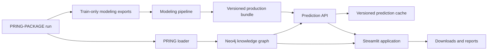

# System architecture

## Services

| Service | Responsibility | Persistent state |
|---|---|---|
| `neo4j` | Graph storage, queries, constraints, and GDS | Neo4j volume |
| `pring-loader` | Load one immutable package run | None |
| `modeling` | Train and validate models from registered exports | Models and reports |
| `predictor` | Reference/cache lookup, guarded live inference, explanations | Separate prediction cache |
| `streamlit` | Exploration, downloads, reports, and prediction UI | None |

## Trust boundaries

- Browser clients do not receive Neo4j or model filesystem credentials.
- Streamlit calls the predictor through an authenticated internal API.
- Models and prepared graph data are mounted read-only in production.
- Prediction cache data never becomes supervised evidence.
- The production overlay binds public ports conservatively and rejects
  unversioned assets.

## Extending beyond CYP450

The UI and domain language can be adapted, but the graph must still conform to
the PRING run contract. Domain-specific labels, evidence rules, candidate
semantics, and reports should be configured explicitly rather than encoded as
implicit CYP450 assumptions.

