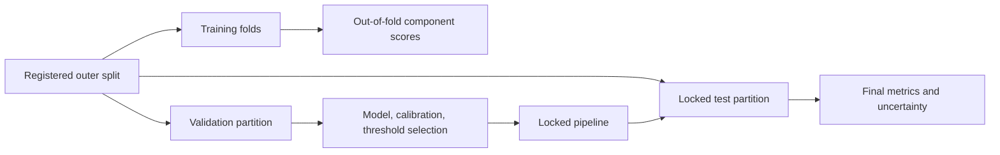

# Modeling pipeline

## Split discipline

The authoritative split is created before model fitting and shared across
components. Compound or similarity groups must not cross outer partitions.

## Selection rules

- Fit preprocessing and models on training data only.
- Create stacking features out of fold for training rows.
- Select hyperparameters and seeds using training/CV or validation evidence.
- Fit calibration and select the operating threshold on validation data.
- Evaluate the locked test partition once.

The default final ensemble is a fixed, equal-weight mean of the three components
that the live predictor can reproduce: Stage 1 Extra Trees, sampled R-GCN, and
sampled HGT. Calibration and the operating threshold are fitted on the
registered validation partition; the test partition is evaluated only after
those choices are locked. A learned stack remains available only when every
meta-training score is explicitly marked out of fold.

Generated component re-splits, reused holdout scores, missing provenance, and
learned stacks with non-OOF training scores are marked `diagnostic_only` or
rejected in strict mode.

## Production bundle gate

Bundle creation rejects:

- all-component held-out scores that are later re-split;
- duplicate compound–target pairs;
- compounds crossing final partitions;
- component/final split disagreement;
- missing train, validation, or test partitions.

New bundles record runtime versions, training-frame hash, split and feature
identity, model version, and model-file digest.

## Required evaluation

Report discrimination, class-balanced metrics, calibration, uncertainty,
per-target results, abstentions, and applicability-domain behavior. Include an
external or temporal validation set whenever the scientific claim extends
beyond the sampled graph.
